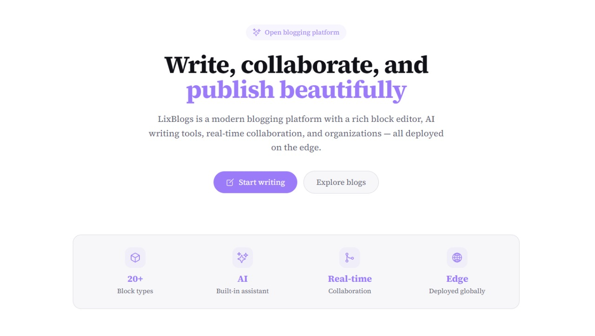
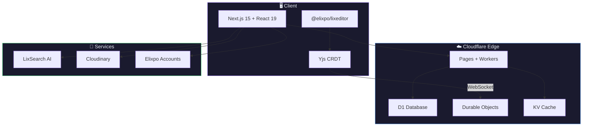

<div align="center">


# LixBlogs

### Write, collaborate, and publish beautifully.

A modern blogging platform with a rich block editor, AI writing assistant,<br />
real-time collaboration, and organizations — all on the edge.

<br />

[](https://blogs.elixpo.com)
[](https://github.com/elixpo/lixblogs)
[](https://www.npmjs.com/package/@elixpo/lixeditor)
[](LICENSE)

[](https://nextjs.org)
[](https://react.dev)
[](https://pages.cloudflare.com)
[](https://tailwindcss.com)
[](https://blocknotejs.org)

</div>

<br />

<div align="center">

</div>

<br />

## What is LixBlogs?

LixBlogs is a **free, open-source blogging platform** designed for creators, developers, and teams. It gives you a beautiful writing experience with powerful tools built right in — no plugins to install, no complicated setup.

Whether you're writing a personal blog, publishing under your organization, or co-authoring with teammates in real-time, LixBlogs has you covered.

<br />

<div align="center">

| | Feature | Description |
|:---:|:---|:---|
| :sparkles: | **AI Writing Assistant** | Press `Space` on an empty line — generate text, images, and get inline suggestions |
| :jigsaw: | **Rich Block Editor** | 20+ block types — code, math equations, diagrams, embeds, tables, and more |
| :busts_in_silhouette: | **Real-Time Collaboration** | Invite co-authors and edit together with live cursors and presence |
| :office: | **Organizations & Teams** | Create orgs, assign roles, organize content into collections |
| :cloud: | **Auto-Save & Cloud Sync** | Drafts save locally and sync to the cloud — never lose a word |
| :art: | **Themes & Customization** | Light & dark modes, custom page colors, cover images, page emojis |
| :link: | **Link Previews** | Hover any link to see a rich OG preview card with title, image, favicon |
| :page_facing_up: | **Sub-Pages** | Nest pages inside your blog for structured, multi-page content |
| :framed_picture: | **Media Uploads** | Drag & drop images, auto-compressed to WebP, tier-based storage |
| :bookmark_tabs: | **Library & Bookmarks** | Save posts, organize into collections, track reading history |

</div>

<br />


## `@elixpo/lixeditor` — Use Our Editor Anywhere

The editor that powers LixBlogs is available as a **standalone npm package**. Drop it into any React or Next.js app to get a fully-featured WYSIWYG editor with equations, diagrams, code highlighting, and more.

```bash
npm install @elixpo/lixeditor @blocknote/core @blocknote/react @blocknote/mantine
```

```jsx
import { LixEditor, LixPreview, LixThemeProvider } from '@elixpo/lixeditor';
import '@blocknote/core/fonts/inter.css';
import '@blocknote/mantine/style.css';
import '@elixpo/lixeditor/styles';

function App() {
  const [blocks, setBlocks] = useState(null);

  return (
    <LixThemeProvider defaultTheme="dark">
      <LixEditor
        initialContent={blocks}
        onChange={(editor) => setBlocks(editor.getBlocks())}
        features={{ equations: true, mermaid: true, codeHighlighting: true }}
        placeholder="Start writing..."
      />
      <LixPreview blocks={blocks} />
    </LixThemeProvider>
  );
}
```

<div align="center">

| Feature | Default | Description |
|---------|:-------:|-------------|
| `equations` | :white_check_mark: | Block & inline LaTeX via KaTeX |
| `mermaid` | :white_check_mark: | Mermaid diagrams (flowcharts, sequence, git graphs) |
| `codeHighlighting` | :white_check_mark: | Shiki syntax highlighting — 30+ languages |
| `tableOfContents` | :white_check_mark: | Auto-generated TOC from headings |
| `images` | :white_check_mark: | Upload, embed URL, paste, drag & drop |
| `dates` | :white_check_mark: | Inline date picker chips |
| `linkPreview` | :white_check_mark: | OG metadata tooltip on link hover |
| `markdownLinks` | :white_check_mark: | Auto-convert `[text](url)` and `` |

</div>

Every feature is toggleable. Override CSS variables to match your brand:

```css
:root {
  --lix-accent: #e040fb;
  --lix-bg-app: #fafafa;
  --lix-font-body: 'Inter', sans-serif;
}
```

:point_right: **[Full documentation →](packages/lixeditor/README.md)**

<br />

## How It Works

```mermaid
graph LR
    A["🔐 Sign Up"] -->|Elixpo OAuth| B["✍️ Write"]
    B -->|Block Editor| C["🤖 AI Assist"]
    C -->|Generate & Edit| D["👥 Collaborate"]
    D -->|Real-time Sync| E["🚀 Publish"]
    E -->|blogs.elixpo.com| F["🌍 Readers"]

    style A fill:#9b7bf7,stroke:#7c5ce0,color:#fff
    style B fill:#60a5fa,stroke:#3b82f6,color:#fff
    style C fill:#c084fc,stroke:#a855f7,color:#fff
    style D fill:#4ade80,stroke:#22c55e,color:#fff
    style E fill:#f59e0b,stroke:#d97706,color:#fff
    style F fill:#f87171,stroke:#ef4444,color:#fff
```



<br />

## The Editor

The heart of LixBlogs is a **powerful block editor** built on [BlockNote](https://blocknotejs.org) — it feels like writing in Notion, but built for publishing.

<div align="center">

| Block Type | What It Does |
|:---|:---|
| Paragraphs, Headings | Standard text with markdown shortcuts |
| Code Blocks | Syntax-highlighted with 30+ languages via Shiki |
| Math / LaTeX | Block & inline equations with KaTeX rendering |
| Mermaid Diagrams | Flowcharts, sequence diagrams, git graphs, and more |
| Images | Upload, embed URL, paste, drag & drop — auto WebP compression |
| Links | Auto-convert URLs, `[text](url)` syntax, OG preview on hover |
| Tables | Full table support with header rows |
| Checklists | Interactive checkboxes with checked/unchecked styling |
| Table of Contents | Auto-generated from your headings |
| Sub-Pages | Nest child pages inside your blog |
| Date Stamps | Inline date chips with a mini calendar picker |
| Mentions | Tag users `@name`, blogs, and organizations |
| Dividers | Horizontal rules to separate sections |

</div>

<br />

## Architecture



<br />

## Quick Start

```bash
# Clone the repo
git clone https://github.com/elixpo/lixblogs.git
cd lixblogs

# Install dependencies
npm install

# Start dev server
npm run dev
```

```bash
# Other commands
npm run build            # Build for Cloudflare Pages
npm run preview          # Local Cloudflare Pages preview
npm run deploy           # Build + deploy to Cloudflare Pages
npm run db:migrate       # Run D1 migrations (remote)
```

<br />

## Project Structure

```
lixblogs/
├── app/                    # Next.js App Router — pages, layouts, API routes
├── src/
│   ├── components/Editor/  # Blog editor — BlockNote + AI + mentions + collab
│   ├── views/              # Page-level components
│   ├── context/            # Auth & theme context providers
│   ├── ai/                 # LixSearch AI agent + prompts
│   └── styles/editor/      # Editor & preview CSS
├── packages/
│   └── lixeditor/          # @elixpo/lixeditor — standalone editor package
├── lib/                    # Server-side utilities (auth, cloudinary, rate limiting)
├── migrations/             # D1 SQL migrations
└── deploy.sh               # One-command deploy & release script
```

<br />

## Built With

<div align="center">

<table>
<tr>
<td align="center" width="120">
<br />
<sub><b>Next.js 15</b></sub>
</td>
<td align="center" width="120">
<br />
<sub><b>React 19</b></sub>
</td>
<td align="center" width="120">
<br />
<sub><b>Tailwind CSS</b></sub>
</td>
<td align="center" width="120">
<br />
<sub><b>Cloudflare</b></sub>
</td>
<td align="center" width="120">
<br />
<sub><b>D1 (SQLite)</b></sub>
</td>
</tr>
</table>
</div>

<br />

## Deploy & Release

```bash
# Deploy website
./deploy.sh deploy

# Release editor package to npm + GitHub Packages
./deploy.sh release editor --patch

# Release everything (editor + website)
./deploy.sh release all --minor

# Preview without executing
./deploy.sh release all --dry-run
```

<br />

## Project Activity

<div align="center">

[](https://www.star-history.com/?repos=elixpo%2Flixblogs&type=date&legend=top-left)

<br />


</div>

<br />

## License

This project is licensed under the **MIT License** — see the [LICENSE](LICENSE) file for details.


<div align="center">

**Made with :purple_heart: by [Elixpo](https://github.com/elixpo)**

[Website](https://blogs.elixpo.com) · [Editor Package](https://www.npmjs.com/package/@elixpo/lixeditor) · [Report Bug](https://github.com/elixpo/lixblogs/issues) · [Request Feature](https://github.com/elixpo/lixblogs/issues)

</div>
