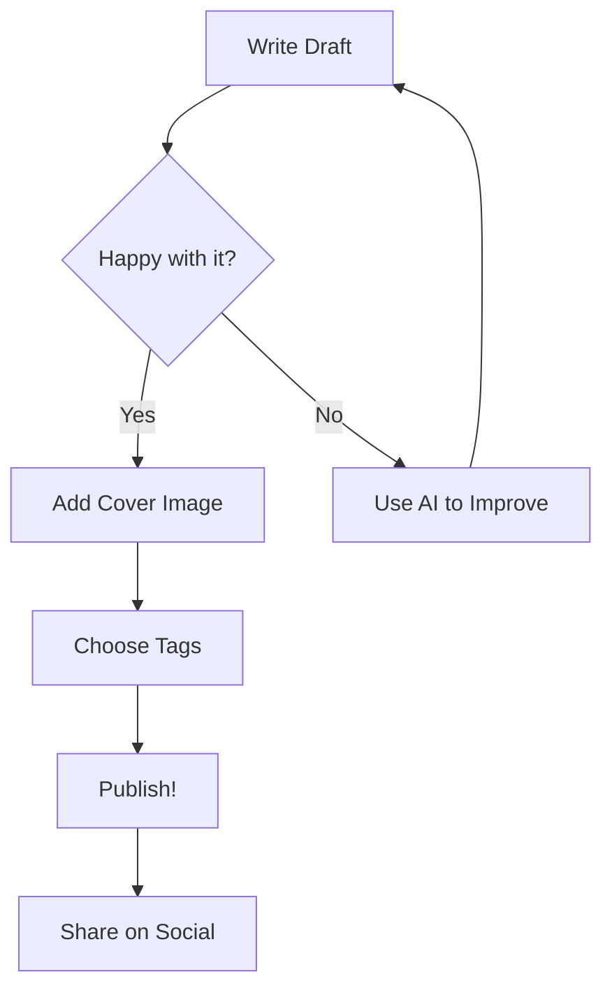
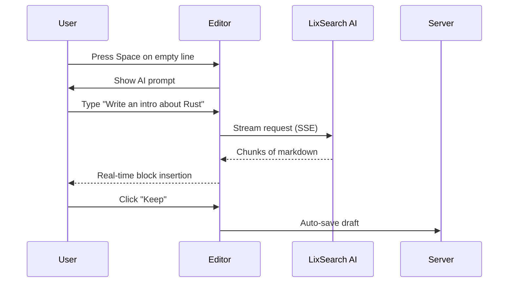
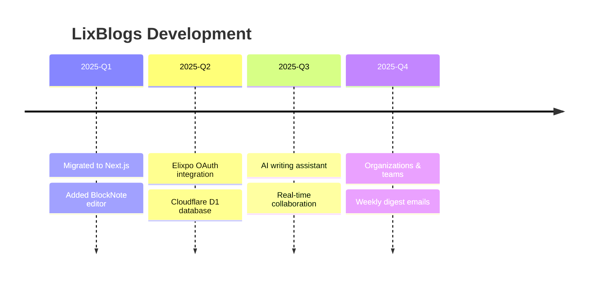
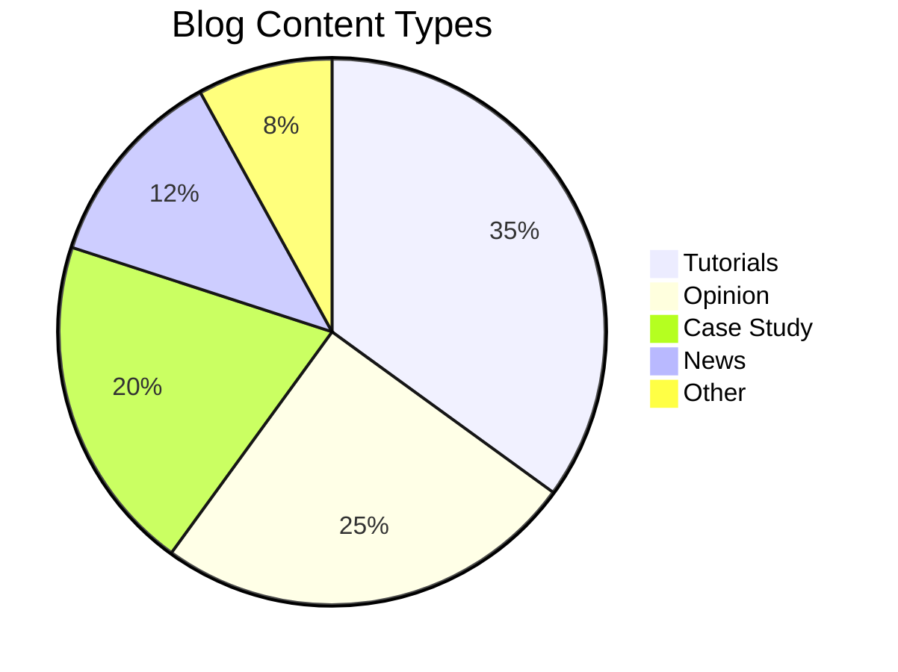

# LixBlogs Editor Showcase

Welcome to the **LixBlogs WYSIWYG Editor** — a rich block editor built for modern blogging. This document demonstrates every block type, inline format, and feature available.

---

## Text Formatting

The editor supports all standard inline styles:

This is **bold text**, this is *italic text*, this is ***bold italic***, this is ~~strikethrough~~, and this is `inline code`. You can also [add links](https://blogs.elixpo.com) to any text.

Combine them freely: **bold with `code` inside**, *italic with [a link](https://blogs.elixpo.com)*, or ~~strikethrough with **bold**~~.

---

## Headings

The editor supports three levels of headings (H1 is reserved for the blog title):

## This is a Heading 2

### This is a Heading 3

Use headings to create structure. The **Table of Contents** block auto-generates an outline from your headings.

---

## Lists

### Bullet Lists

- First item in an unordered list
- Second item with **bold** emphasis
- Nested items work too:
  - Sub-item one
  - Sub-item two
    - Even deeper nesting
- Back to the top level

### Numbered Lists

1. First step in a process
2. Second step with `code reference`
3. Third step
   1. Sub-step A
   2. Sub-step B
4. Final step

### Checklists

- [x] Set up your LixBlogs account
- [x] Write your first draft
- [ ] Add a cover image
- [ ] Choose tags and publish
- [ ] Share with the world

---

## Blockquotes

> "The scariest moment is always just before you start."
> — Stephen King

Blockquotes are great for callouts, pull quotes, or highlighting key takeaways from your post.

> **Pro tip:** You can nest formatting inside blockquotes — **bold**, *italic*, `code`, and even [links](https://blogs.elixpo.com).

---

## Code Blocks

The editor uses **Shiki** for syntax highlighting with 100+ language support.

### JavaScript

```javascript
async function fetchPosts(tag) {
  const res = await fetch(`/api/feed?tag=${encodeURIComponent(tag)}`);
  const { posts } = await res.json();
  return posts.filter(p => p.status === 'published');
}
```

### Python

```python
from dataclasses import dataclass
from typing import List

@dataclass
class BlogPost:
    title: str
    tags: List[str]
    read_time: int

    def is_long_read(self) -> bool:
        return self.read_time > 10
```

### SQL

```sql
SELECT b.title, u.username, COUNT(l.blog_id) AS likes
FROM blogs b
JOIN users u ON u.id = b.author_id
LEFT JOIN likes l ON l.blog_id = b.id
WHERE b.status = 'published'
GROUP BY b.id
ORDER BY likes DESC
LIMIT 10;
```

### Bash

```bash
#!/bin/bash
npm run pages:build
npx wrangler pages deploy .vercel/output/static \
  --project-name lixblogs \
  --branch main
echo "Deployed successfully!"
```

### CSS

```css
.feed-card {
  background: var(--bg-surface);
  border: 1px solid var(--border-default);
  border-radius: 12px;
  transition: box-shadow 0.2s ease;
}

.feed-card:hover {
  box-shadow: 0 4px 16px rgba(0, 0, 0, 0.08);
}
```

---

## Tables

Tables support headers, alignment, and rich content:

| Feature | Free Plan | Member Plan |
|:--------|:---------:|------------:|
| Storage | 50 MB | 2 GB |
| AI Requests / Day | 15 | 50 |
| Co-authors per Blog | 3 | 5 |
| Organizations | 1 | 5 |
| Member-only Content | No | Yes |
| Custom Page Colors | No | Yes |

---

## Mathematics (LaTeX / KaTeX)

### Inline Math

The quadratic formula is \(x = \frac{-b \pm \sqrt{b^2 - 4ac}}{2a}\) and Euler's identity is \(e^{i\pi} + 1 = 0\).

### Block Equations

The Gaussian distribution probability density function:

\[f(x) = \frac{1}{\sigma\sqrt{2\pi}} e^{-\frac{1}{2}\left(\frac{x-\mu}{\sigma}\right)^2}\]

Maxwell's equations in differential form:

\[\nabla \cdot \mathbf{E} = \frac{\rho}{\varepsilon_0}, \quad \nabla \times \mathbf{B} = \mu_0\mathbf{J} + \mu_0\varepsilon_0\frac{\partial \mathbf{E}}{\partial t}\]

Summation notation:

\[\sum_{n=1}^{\infty} \frac{1}{n^2} = \frac{\pi^2}{6}\]

---

## Mermaid Diagrams

### Flowchart



### Sequence Diagram



### Timeline



### Pie Chart



### Git Graph

```mermaid
gitgraph
    commit id: "init"
    branch feature/editor
    commit id: "add BlockNote"
    commit id: "custom blocks"
    checkout main
    merge feature/editor
    branch feature/ai
    commit id: "AI streaming"
    commit id: "inline edit"
    checkout main
    merge feature/ai
    commit id: "v1.0 release"
```

---

## Tabs

Tabs let you organize content into switchable panels — great for showing code in multiple languages, comparing approaches, or step-by-step guides.

Use the `/tabs` slash command to insert a tabbed section. Each tab has its own title and content area that supports all block types (text, code, lists, images, etc.).

**Example use cases:**
- Code snippets in JavaScript / Python / Go side by side
- Installation instructions for different operating systems
- Before / After comparisons
- Beginner / Advanced versions of the same tutorial

---

## Images

Images support three modes:

1. **Upload** — drag and drop or click to upload (auto-compressed to WebP)
2. **Embed URL** — paste any image URL
3. **AI Generate** — describe an image and AI creates it inline

Images are automatically compressed client-side and stored on Cloudinary with tier-based storage limits.

---

## Blockquote Variations

> A simple blockquote for emphasis.

> **Warning:** Be careful when using `git reset --hard` — it permanently discards uncommitted changes.

> *"Write what should not be forgotten."*
> — Isabel Allende

---

## Horizontal Rules

Use horizontal rules (`---`) to create visual breaks between major sections. They render as clean dividers that help readers scan long posts.

---

## Nested Content

> **Inside a blockquote:**
>
> - You can have lists
> - With **formatted** text
> - And even `code`
>
> 1. Numbered lists too
> 2. With multiple items

---

## Text Colors & Highlights

The editor toolbar includes:

- **Text Color** picker — 10 colors including default, white, gray, red, orange, yellow, green, blue, purple, pink
- **Highlight** picker — 9 highlight backgrounds for marking important passages

---

## Inline Elements

Beyond standard formatting, the editor supports special inline content:

- **Inline Equations** — LaTeX rendered inline: \(E = mc^2\)
- **Date stamps** — Insert today's date as a chip
- **@Mentions** — Tag users, blogs, or organizations
- **Links** — Standard hyperlinks with preview on hover

---

## AI Features

### Content Generation (Space key)

Press **Space** on an empty line to open the AI prompt. Ask it to:

- Write a full blog section
- Generate an introduction or conclusion
- Create a list of pros and cons
- Draft a technical explanation
- Generate images inline

### Inline Editing (Star button)

Select text and click the **star icon** in the toolbar to:

- Fix grammar and spelling
- Paraphrase text
- Improve writing quality
- Make text more concise
- Change tone (formal, casual, etc.)
- Translate to another language

AI responses show word-level diffs with strikethrough deletions and purple additions.

---

## Custom Blocks Summary

| Block | Slash Command | Description |
|:------|:-------------|:------------|
| Table of Contents | `/toc` | Auto-generated outline from headings |
| Block Equation | `/equation` | Full-width LaTeX rendering |
| Mermaid Diagram | `/diagram` | Flowcharts, sequences, timelines, pie charts |
| Image | `/image` | Upload, URL embed, or AI generate |
| Code Block | `/code` | Syntax-highlighted with 100+ languages |
| Table | `/table` | Full tables with resizable columns |
| Button | `/button` | Interactive CTA button |
| Breadcrumbs | `/breadcrumbs` | Navigation breadcrumb trail |
| Tabs | `/tabs` | Tabbed content sections |
| AI Block | `/ai` | Generate content with AI |
| PDF Embed | `/pdf` | Embed PDF documents |

---

## Keyboard Shortcuts

| Shortcut | Action |
|:---------|:-------|
| `Ctrl + S` | Save & sync to cloud |
| `Ctrl + O` | Import markdown file |
| `Ctrl + Shift + P` | Toggle editor / preview |
| `Ctrl + B` | Bold |
| `Ctrl + I` | Italic |
| `Ctrl + U` | Underline |
| `Ctrl + E` | Inline code |
| `Ctrl + K` | Add link |
| `Ctrl + Z` | Undo |
| `Ctrl + Shift + Z` | Redo |
| `/` | Slash commands menu |
| `Space` | AI assistant (empty line) |
| `@` | Mention user/blog/org |

---

> **That's everything.** The LixBlogs editor gives you a Notion-like writing experience with the power of AI, LaTeX, Mermaid diagrams, and real-time collaboration — all deployed on the edge.

*Built with BlockNote, Next.js, and Cloudflare.*
